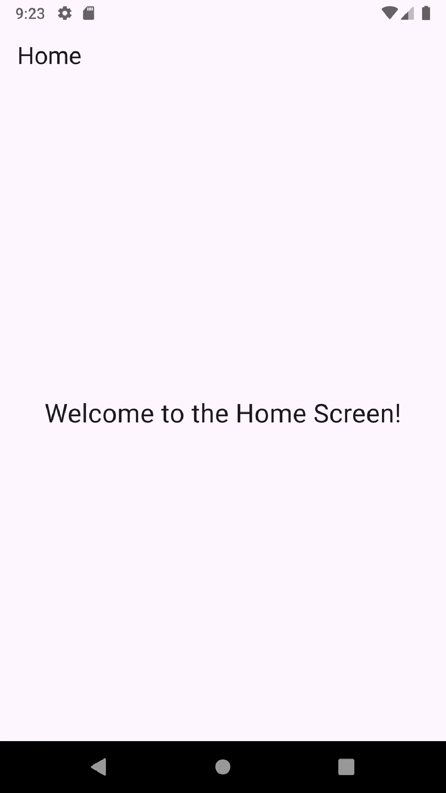

# Onboarding App
A Flutter application featuring an animated splash screen and an onboarding process with steps. The app provides essential information before entering the main interface.

## 🌟 Features
- Animated splash screen
- Three-step onboarding process
- Skip button to move directly to the home screen
- Navigation buttons to move back and forth between steps
- Visual indicators for onboarding progress
- Clean and modern design with a professional theme

## 📸 Screenshots
<p>

</p>

## 🛠️ Technologies Used
- **Frontend**: Flutter, Dart
- **State Management**: StatefulWidget
- **Plugins**: animations, flutter_svg, page_transition

## 📝 Setup Instructions
Follow these steps to set up the project locally:

### 1. Clone the Repository
```bash
git clone https://github.com/obadaKraishan/Onboarding_App.git
cd Onboarding_App
```

### 2. Install Dependencies
```bash
flutter pub get
```

### 3. Run the Application
```bash
flutter run
```

## 📄 Project Structure
```plaintext
lib/
├── main.dart
├── screens/
│   ├── home_screen.dart
│   ├── onboarding_screen.dart
├── widgets/
│   ├── animated_splash_screen.dart
│   ├── onboarding_step.dart
```

## 🎨 Customization
### 1. Update Theme
Modify the theme settings in `main.dart` to customize the app's look and feel.

### 2. Update Onboarding Steps
Adjust the steps in `lib/screens/onboarding_screen.dart` to change the content of the onboarding process.

### 3. Add New Features
Create new features and screens in the `lib/screens/` directory and include them in the app's navigation.

## 📄 License
This project is licensed under the MIT License - see the [LICENSE](LICENSE) file for details.

## 👥 Contributors
- [Obada Kraishan](https://github.com/obadaKraishan)
